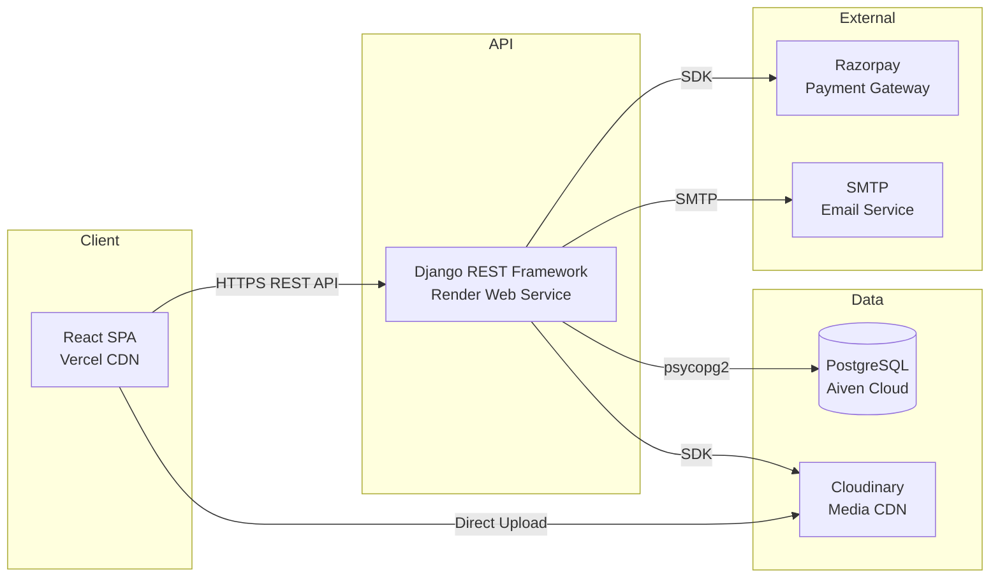
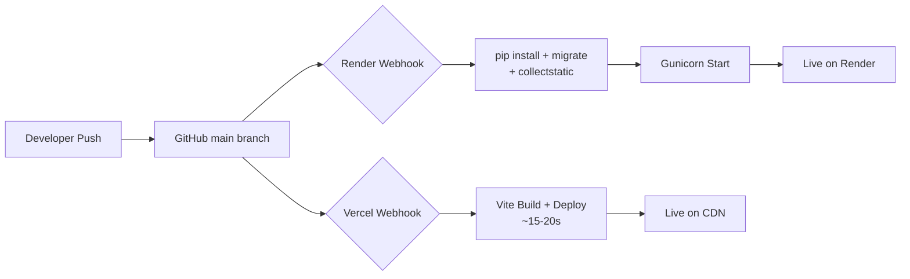
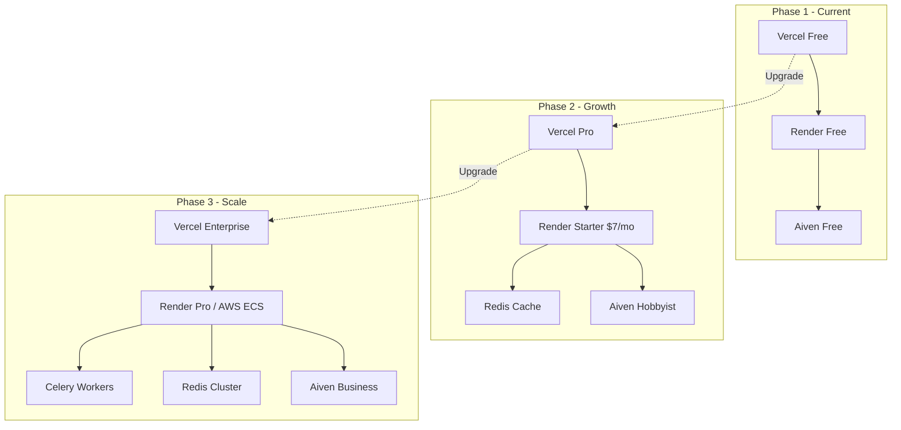

# Anantamart — Technical Architecture Overview

> **B2B Wholesale Platform** | Production URL: [ananta-mart.in](https://ananta-mart.in)

---

## 1. High-Level Architecture

Anantamart follows a **decoupled, three-tier architecture** with independently deployed frontend, backend, and database layers communicating over secure REST APIs.



| Layer       | Technology                        | Hosting       | Domain              |
|-------------|-----------------------------------|---------------|---------------------|
| Frontend    | React 19 + Vite + Tailwind CSS    | Vercel (Free) | `ananta-mart.in`    |
| Backend     | Django 6.0 + DRF 3.16             | Render (Free) | `api.ananta-mart.in`|
| Database    | PostgreSQL 16                     | Aiven (Free)  | Managed Cloud       |
| Media/CDN   | Cloudinary                        | Free Tier     | CDN-delivered        |
| Payments    | Razorpay                          | Production    | PCI DSS Compliant   |

---

## 2. Infrastructure Breakdown

### 2.1 Frontend — Vercel

| Aspect              | Detail                                                         |
|---------------------|----------------------------------------------------------------|
| **Framework**       | React 19.1 with Vite 6.x build tool                           |
| **Styling**         | Tailwind CSS 3.4 (utility-first, purged in production)         |
| **Routing**         | React Router DOM 7.x (client-side SPA routing)                 |
| **HTTP Client**     | Axios with interceptors for JWT token refresh                  |
| **Icons**           | Lucide React (tree-shakeable SVG icons)                        |
| **State Mgmt**      | React Context API (Auth, Cart, Toast contexts)                 |
| **Build Output**    | Static assets served via Vercel's global Edge CDN              |
| **Custom Domain**   | `ananta-mart.in` with automatic SSL via Let's Encrypt          |

**Key Frontend Patterns:**
- **Portal-based UI**: Search bar and category navigation rendered via `createPortal()` into the sticky header for reliable mobile behavior
- **Browser History API**: Custom `pushState`/`popstate` integration for native mobile back-swipe navigation within the SPA
- **Lazy image loading**: All product and category images use `loading="lazy"` for performance
- **Touch-optimized**: `touch-manipulation` CSS, minimum 44×44px touch targets (WCAG compliant)

### 2.2 Backend — Render

| Aspect              | Detail                                                         |
|---------------------|----------------------------------------------------------------|
| **Framework**       | Django 6.0 with Django REST Framework 3.16                     |
| **WSGI Server**     | Gunicorn (production-grade, multi-worker)                      |
| **Authentication**  | JWT via `djangorestframework-simplejwt` (access + refresh tokens) |
| **Static Files**    | WhiteNoise middleware (compressed, cache-optimized)             |
| **CORS**            | `django-cors-headers` with explicit origin allow list          |
| **Filtering**       | `django-filter` for product catalog queries                    |
| **Media Storage**   | Cloudinary SDK (cloud-hosted, CDN-delivered images)            |
| **Payments**        | Razorpay SDK with server-side order creation and verification  |
| **Email**           | Django SMTP backend for order confirmation notifications       |
| **Build Script**    | Automated `build.sh` — installs deps, collects static, runs migrations |

**Django App Structure:**
```
backend/
├── config/settings/     # Split settings (base, dev, production)
├── apps/
│   ├── products/        # Catalog, categories, subcategories, brands
│   ├── cart/            # Shopping cart with per-item pricing
│   ├── orders/          # Order lifecycle, payment verification, stock validation
│   └── users/           # Authentication, profiles, password reset
├── build.sh             # Render build hook
└── requirements.txt     # Pinned dependencies
```

### 2.3 Database — Aiven PostgreSQL

| Aspect              | Detail                                                         |
|---------------------|----------------------------------------------------------------|
| **Engine**          | PostgreSQL 16 (managed)                                        |
| **Connection**      | SSL-encrypted via `dj-database-url` parsing                    |
| **Driver**          | `psycopg2-binary` (C-optimized PostgreSQL adapter)             |
| **Migrations**      | Django ORM migrations with automated execution on deploy       |
| **Backup**          | Aiven-managed automatic daily backups                          |

### 2.4 Media & CDN — Cloudinary

All product images, brand logos, and subcategory thumbnails are stored on **Cloudinary**, providing:
- Automatic image optimization and format conversion (WebP/AVIF)
- On-the-fly transformations (resize, crop, quality adjustment)
- Global CDN delivery with edge caching
- Django integration via `django-cloudinary-storage`

---

## 3. CI/CD Workflow



| Stage             | Frontend (Vercel)                       | Backend (Render)                        |
|-------------------|----------------------------------------|----------------------------------------|
| **Trigger**       | Git push to `main`                     | Git push to `main`                     |
| **Build**         | `vite build` (< 20s)                   | `build.sh` (pip install + migrate)     |
| **Deploy**        | Instant atomic deploy to CDN           | Zero-downtime deploy with health check |
| **Rollback**      | One-click via Vercel dashboard         | Re-deploy previous commit via Render   |
| **Preview**       | Automatic preview URLs per PR          | Manual staging branch                  |
| **Environment**   | Vercel env vars (per-environment)      | Render env vars (encrypted at rest)    |

**Deployment is fully automated** — every push to `main` triggers parallel builds on both platforms with no manual intervention required.

---

## 4. Environment Configuration Strategy

All secrets and configuration are managed through **environment variables**, following the [12-Factor App](https://12factor.net/) methodology.

| Variable Category    | Examples                                              | Storage            |
|---------------------|-------------------------------------------------------|--------------------|
| **Database**        | `DATABASE_URL`                                        | Render Env Vars    |
| **Security**        | `SECRET_KEY`, `DEBUG`                                 | Render Env Vars    |
| **API Endpoints**   | `VITE_API_URL`                                        | Vercel Env Vars    |
| **Payments**        | `RAZORPAY_KEY_ID`, `RAZORPAY_KEY_SECRET`              | Render Env Vars    |
| **Media**           | `CLOUDINARY_CLOUD_NAME`, `CLOUDINARY_API_KEY/SECRET`  | Render Env Vars    |
| **Email**           | `EMAIL_HOST`, `EMAIL_HOST_USER`, `EMAIL_HOST_PASSWORD`| Render Env Vars    |
| **Superuser**       | `DJANGO_SUPERUSER_*`                                  | Render Env Vars    |

**No secrets are committed to version control.** The `.env` file is `.gitignore`-d and each platform provides its own encrypted secret management.

---

## 5. Security Best Practices

| Practice                          | Implementation                                           |
|----------------------------------|----------------------------------------------------------|
| **Authentication**               | JWT (access + refresh tokens) with automatic rotation    |
| **CORS Policy**                  | Explicit origin allow list (no wildcards in production)  |
| **HTTPS Everywhere**             | Enforced by Vercel (frontend) and Render (API)           |
| **Database Encryption**          | SSL/TLS encrypted connections to Aiven PostgreSQL        |
| **Secret Management**            | Environment variables only — zero hardcoded secrets      |
| **CSRF Protection**              | Django CSRF middleware enabled                           |
| **Input Validation**             | DRF serializer validation on all API endpoints           |
| **SQL Injection Prevention**     | Django ORM parameterized queries (no raw SQL)            |
| **XSS Prevention**               | React's automatic JSX escaping + CSP headers             |
| **Payment Security**             | Server-side Razorpay signature verification              |
| **Stock Validation**             | Pre-payment stock checks to prevent overselling          |
| **Password Security**            | Django's PBKDF2 password hashing with salt               |
| **Static File Security**         | WhiteNoise with immutable cache headers                  |

---

## 6. Performance Optimizations

### Frontend
- **Vite production build** — tree-shaking, code splitting, minification
- **Tailwind CSS purging** — removes unused CSS (final bundle < 15KB gzipped)
- **Edge CDN delivery** — Vercel serves assets from 100+ global edge locations
- **Lazy image loading** — `loading="lazy"` on all product images
- **Optimized re-renders** — React Context + selective state updates
- **Immutable asset caching** — content-hashed filenames with long cache TTL

### Backend
- **Gunicorn multi-worker** — concurrent request handling
- **WhiteNoise compression** — gzip/brotli static file compression with forever-cache headers
- **Database connection pooling** — via `dj-database-url` configuration
- **Cloudinary CDN** — offloads image serving from the application server
- **Serializer optimization** — `SerializerMethodField` for computed properties
- **Django ORM query optimization** — select_related/prefetch_related where applicable

### Database
- **Managed PostgreSQL** — Aiven handles vacuuming, index maintenance, and query optimization
- **Connection SSL** — encrypted transport with minimal overhead

---

## 7. Free-Tier Limitations

> [!WARNING]
> The following constraints apply to the current free-tier deployment.

| Service      | Limitation                              | Impact                                    | Mitigation                        |
|-------------|----------------------------------------|-------------------------------------------|-----------------------------------|
| **Render**   | Spins down after 15 min inactivity     | First request after idle takes ~30-50s    | Cron-based health check ping      |
| **Render**   | 750 hours/month compute                | Sufficient for single service             | Monitor usage dashboard           |
| **Render**   | 512 MB RAM                             | Limits concurrent connections             | Optimize Django memory usage      |
| **Aiven**    | 1 GB storage, 1 node                   | No read replicas, limited storage         | Monitor data growth               |
| **Aiven**    | Auto-pauses after inactivity           | Occasional cold-start latency             | Keep-alive queries                |
| **Vercel**   | 100 GB bandwidth/month                 | Sufficient for moderate traffic           | Cloudinary offloads image traffic |
| **Vercel**   | No server-side rendering (free)        | SPA-only (no SSR/ISR)                     | Client-side rendering is adequate |
| **Cloudinary**| 25 credits/month                      | ~25K transformations or 25GB storage      | Use upload presets to limit sizes |

---

## 8. Future Scalability Plan



| Phase   | Trigger                    | Actions                                                   |
|---------|---------------------------|-----------------------------------------------------------|
| **Phase 1** | Current (MVP)          | Free-tier deployment, manual monitoring                   |
| **Phase 2** | 100+ daily users       | Upgrade Render to paid (no cold starts), add Redis cache  |
| **Phase 3** | 1000+ daily users      | Horizontal scaling, CDN optimization, background workers  |
| **Phase 4** | Enterprise             | Multi-region deploy, read replicas, load balancing         |

**Scaling levers available without re-architecture:**
- Render → AWS ECS / Railway (Docker-based, zero code changes)
- Aiven PostgreSQL → scale vertically or add read replicas
- Vercel → handles scale automatically with CDN
- Add Redis for session/cache layer (Django has built-in support)
- Add Celery for background tasks (email, inventory sync)

---

## 9. Cost Optimization

| Service      | Current Cost     | Value Delivered                                  |
|-------------|------------------|--------------------------------------------------|
| Vercel       | **$0/month**     | Global CDN, auto SSL, instant deploys            |
| Render       | **$0/month**     | Managed Django hosting, auto deploys, SSL        |
| Aiven        | **$0/month**     | Managed PostgreSQL, automated backups, SSL       |
| Cloudinary   | **$0/month**     | Image hosting, optimization, CDN delivery        |
| GitHub       | **$0/month**     | Version control, CI/CD webhooks                  |
| **Total**    | **$0/month**     | Full production B2B platform                     |

**Cost optimization strategies:**
- Cloudinary offloads bandwidth-heavy image serving from Render
- Tailwind's CSS purging minimizes frontend bundle size
- WhiteNoise serves static files efficiently without a separate CDN
- JWT authentication is stateless — no session storage overhead
- PostgreSQL used instead of NoSQL — no need for a separate search service

---

## 10. Technology Stack Summary

```
┌─────────────────────────────────────────────────────────┐
│                      ANANTAMART                          │
│              B2B Wholesale Platform                       │
├─────────────────────────────────────────────────────────┤
│                                                          │
│  FRONTEND            API                 DATA            │
│  ─────────           ───                 ────            │
│  React 19            Django 6.0          PostgreSQL 16   │
│  Vite 6.x            DRF 3.16           Aiven Cloud     │
│  Tailwind CSS 3.4    Gunicorn           Cloudinary CDN   │
│  React Router 7      SimpleJWT                           │
│  Axios               WhiteNoise                          │
│  Lucide Icons        Razorpay SDK                        │
│                                                          │
│  INFRASTRUCTURE                                          │
│  ──────────────                                          │
│  Vercel (CDN)        Render (PaaS)      Aiven (DBaaS)   │
│  GitHub (VCS)        Let's Encrypt      SMTP Email       │
│                                                          │
└─────────────────────────────────────────────────────────┘
```

---

## Repository Structure

```
anantamart-project/
├── frontend/                    # React SPA
│   ├── src/
│   │   ├── components/          # Reusable UI components
│   │   ├── pages/               # Route-level pages
│   │   ├── context/             # Auth, Cart, Toast providers
│   │   ├── hooks/               # Custom React hooks
│   │   ├── api/                 # API service layer (Axios)
│   │   └── utils/               # Helper functions
│   ├── index.html               # Entry point
│   ├── tailwind.config.js       # Tailwind CSS configuration
│   └── vite.config.js           # Vite build configuration
│
├── backend/                     # Django API
│   ├── config/
│   │   └── settings/            # Split settings (base/dev/prod)
│   ├── apps/
│   │   ├── products/            # Product catalog & brands
│   │   ├── cart/                # Shopping cart
│   │   ├── orders/              # Orders & payments
│   │   └── users/               # Auth & profiles
│   ├── build.sh                 # Render deploy hook
│   ├── manage.py                # Django CLI
│   └── requirements.txt         # Python dependencies
│
└── ARCHITECTURE.md              # This document
```

---

<p align="center">
<em>Built and deployed with zero infrastructure cost using modern cloud-native services.</em><br/>
<strong>Anantamart</strong> — Professional B2B Wholesale Platform
</p>
